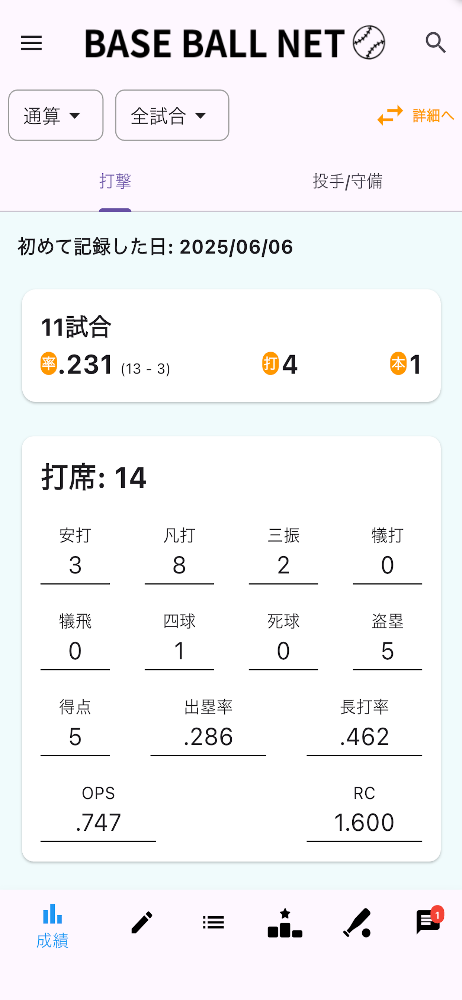
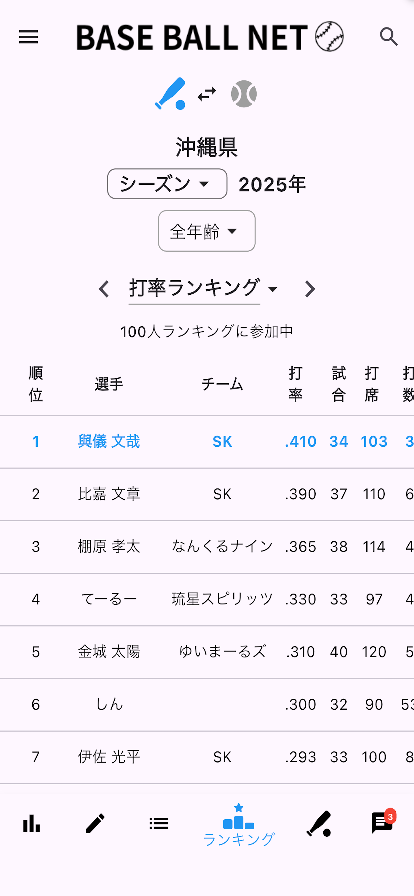
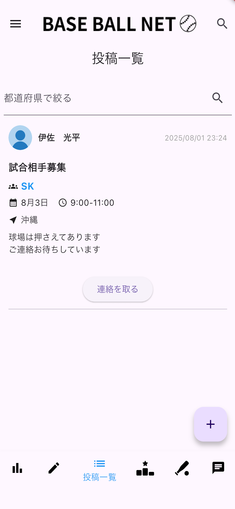
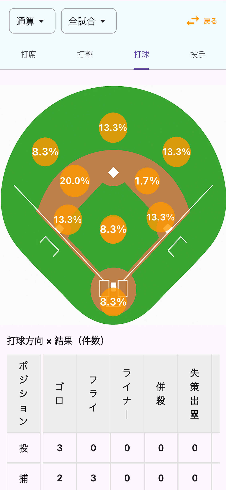

# Baseball Net

Make amateur baseball more fun with data.

Baseball Net is a baseball statistics and team management app designed for amateur and recreational baseball players.

Track personal performance, analyze team statistics, compete in rankings, and connect with other baseball communities.

🍎 App Store  
[Download on the App Store](https://apps.apple.com/jp/app/%E3%83%99%E3%83%BC%E3%82%B9%E3%83%9C%E3%83%BC%E3%83%AB%E3%83%8D%E3%83%83%E3%83%88/id6743166887)

🤖 Google Play  
[Get it on Google Play](https://play.google.com/store/apps/details?id=com.baseballnet.bnet)

---

## Screenshots

| Home | Ranking |
|------|------|
|  |  |

| Community Posts | Team Direction |
|------|------|
|  |  |

---

## Features

- Personal baseball statistics tracking
- Team performance analytics
- Player and team rankings
- Batting and pitching analysis
- Goal tracking and performance forecasting
- Team schedules and event management
- MVP voting system
- Team matching and discovery
- Baseball community features

---

## Tech Stack

### Mobile

- Flutter
- Dart

### Backend

- Firebase
- Cloud Functions

### Web

- Next.js
- TypeScript

### Services

- RevenueCat

---

## Platforms

- App Store (Published)
- Google Play (Published)

---

## Why I Built This

I played baseball throughout elementary school, junior high school, and high school.

Later, I joined amateur baseball teams and realized how enjoyable it was to spend time playing baseball with friends every week.

I wanted to make that experience even more enjoyable.

Baseball Net was created to help players track their progress, motivate teammates, and discover new ways to enjoy amateur baseball through data and community features.

---

## Development Highlights

- Designed and released a production mobile application
- Built a baseball statistics management system
- Developed ranking and analytics features
- Created a web-based admin dashboard using Next.js
- Implemented subscription management using RevenueCat
- Published on App Store and Google Play

---

## Author

### Shinshun Matayoshi

Flutter Developer from Japan

GitHub:
https://github.com/mata-s